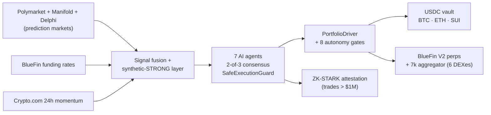

<div align="center">

# ZkVanguard

**An AI-managed USDC vault on Sui — deposit once, autonomous agents allocate & hedge for you.**

Fuses Polymarket prediction signals with BlueFin perpetual hedging. All positions verified against 3 independent reconcilers, defended by 8 layered autonomy gates, and ZK-STARK-attested for trades > $1M once the audit-gated cap lifts. Live on Sui mainnet.

[](https://suiscan.xyz/mainnet/object/0x107292a69eea2f6eaf4a4e4727ee25d747b04c1985441b138933f0ef33f7b726)
[](#status)
[](https://www.zkvanguard.xyz)
[](https://www.zkvanguard.xyz/api/health/production)
[](LICENSE)

[Deposit](https://www.zkvanguard.xyz) · [Live PnL](https://www.zkvanguard.xyz/dashboard/overview) · [Risk overview](https://www.zkvanguard.xyz/dashboard/risk) · [Suiscan proof](https://suiscan.xyz/mainnet/object/0x107292a69eea2f6eaf4a4e4727ee25d747b04c1985441b138933f0ef33f7b726)

</div>

---

## What your USDC does

1. **AI allocates it across BTC / ETH / SUI.** Seven agents fuse Polymarket 5-min binaries, Delphi/Polymarket category markets, Manifold, BlueFin funding rates, and Crypto.com momentum into one directional signal per asset. Rebalances every 30 minutes only when conviction ≥ 65%.
2. **Hedges the downside on BlueFin V2 perps.** Spot leg routed via BlueFin 7k aggregator (Cetus · DeepBook · Turbos · FlowX · Aftermath · BlueFin), directional perp overlay on BlueFin. When AI turns bearish, the perp shorts. When perps are physically unopenable at small NAV, spot cap → 0 for that asset.
3. **Attests decisions on-chain with post-quantum ZK-STARKs.** Python STARK prover (NIST P-521, no trusted setup) is live and unit-tested; configured to attest any trade > $1M. Activation waits on the audit-gated cap lift. On-chain hedge state is reconciled against BlueFin and Postgres every 15 min.

**Fees:** 50 bps annual mgmt + 10% performance. Both charged by the Move contract itself and routed to an MSafe multisig — public, auditable, no operator custody.

## Verify in 60 seconds

```bash
# No clone required — hits live production endpoints
curl -s https://www.zkvanguard.xyz/api/health/production | jq
curl -s https://www.zkvanguard.xyz/api/predictions/per-asset | jq

# With clone — canonical "is the pool in profit?" script
bun run scripts/analyze-pool-pnl.ts
bun run scripts/check-hedge-signal-alignment.ts
```

Or inspect the pool object directly on Suiscan:

- Package: [`0x107292a69eea2f6eaf4a4e4727ee25d747b04c1985441b138933f0ef33f7b726`](https://suiscan.xyz/mainnet/object/0x107292a69eea2f6eaf4a4e4727ee25d747b04c1985441b138933f0ef33f7b726)
- USDC pool state: `0xe814e0948e29d9c10b73a0e6fb23c9997ccc373bed223657ab65ff544742fb3a`
- Deployed 2026-06-12 · [deploy record](./docs/DEPLOY_2026-06-12_v0.2.0.md)

## Safety — the 8-gate autonomy defense system

Shipped July 2026 after a real drawdown revealed passive-only defenses. Each gate defends a specific failure mode; the full stack is verified by an integration test that replays the historical scenario and asserts max NAV loss ≤ 15%.

| Gate | Defends against |
|---|---|
| **PortfolioDriver** | Existing spot never unwound when profit-lock fires — corrective actions actively reshape the balance sheet |
| **Fill verifier** | BlueFin "silent-reject" — orders returning orderHash but never landing on the exchange |
| **Hedgeability spot-cap** | At small NAV, perp minQty makes hedging impossible — spot cap for that asset forced to 0 |
| **Symmetric sell trigger** | Rebalance was one-sided (bought on 65% conviction, never sold on 65% opposing) — now symmetric |
| **Stale-hedge detector** | Positions > 7d old with ≥ 2 signal flips force-close on contradiction |
| **Signal-flip drift-close** | On direction flip, both perp and spot legs unwind — not just perps |
| **AI regret weighting** | Position size shrinks after losing streaks, recovers on wins — prevents AI-euphoria buying tops |
| **Alert response loop** | 3 KILL alerts/hr auto-shrinks spot; 24h profit-lock auto-unwinds; phantom hedge rate > 1% halts trader |

Verify: `bun jest test/integration/pool-drawdown-defense.test.ts` (10/10 green).

**Always-on structural guards:** 2-of-3 agent consensus on trades > $100K · 10% peak-NAV drawdown halt · circuit breaker after 3 failures · 3-way reconciliation (Move ↔ BlueFin ↔ Postgres) · OFAC geo-block (KP/IR/SY/CU/RU/BY) · strict NAV-oracle mode (deposits/withdrawals revert when cron oracle > 2h stale).

## Status

Live on Sui mainnet (v0.2.0, deployed 2026-06-12). **Pre-external-audit**, TVL **deliberately capped at $10K by contract**. Cap lifts after external audit closes — the constraint is intentional operational proof, not a TVL claim.

15 internal audit phases completed pre-mainnet. Engine has been running autonomously since June 2026 with continuous on-chain NAV snapshots; every production incident to date has been caught, remediated, and documented in the deploy record and [`CLAUDE.md`](./CLAUDE.md).

## How it works



## Revenue model

**Live today:** 50 bps annual mgmt + 10% performance fee on vault deposits — charged automatically by `community_pool_usdc.move`, routed to `FeeManagerCap` on MSafe.

**Post-audit (all mapped to shipped code in [`lib/config/pricing.ts`](./lib/config/pricing.ts)):**

- Per-use fees: private hedges ($5 / 25 bps), private portfolios ($100 + 50 bps), custody attestation ($2.5K enrollment + $0.50/submission)
- Subscription tiers: Retail $99 → Pro $499 → Institutional $2,499 → Enterprise
- Per-trade fees on the autonomous perp trader

**Token:** utility-first, designed not launched. Governance over fee parameters, staking gates discounted vault fees. TGE targeted Month 9–12 post-audit.

## Quickstart (contributors)

Node 18+, Bun, Python 3.11+, PostgreSQL.

```bash
git clone https://github.com/ZkVanguard/ZkVanguard.git && cd ZkVanguard
bun install --legacy-peer-deps

# Terminal 1 — ZK-STARK prover
python -m pip install -r zkp/requirements.txt
python zkp/api/server.py

# Terminal 2 — Next.js
bun run dev

# Pre-commit
bun run typecheck && bun run lint && bun jest
```

Full architecture, env conventions, BlueFin invariants, and reconciliation topology: **[CLAUDE.md](./CLAUDE.md)** (authoritative repo guide).

## Documentation & disclosure

- **[CLAUDE.md](./CLAUDE.md)** — architecture, env, gotchas, invariants
- **[docs/DEPLOY_RUNBOOK.md](./docs/DEPLOY_RUNBOOK.md)** — incident response, admin endpoints
- **[docs/DEPLOY_2026-06-12_v0.2.0.md](./docs/DEPLOY_2026-06-12_v0.2.0.md)** — v0.2.0 mainnet deploy record
- **[docs/ARCHITECTURE.md](./docs/ARCHITECTURE.md)** · **[docs/SUI_DEPLOYMENT.md](./docs/SUI_DEPLOYMENT.md)** · **[docs/MAINNET_READINESS.md](./docs/MAINNET_READINESS.md)**

Responsible disclosure: report security issues privately to `ashishregmi2017@gmail.com`. Do not file public issues for active vulnerabilities.

## Acknowledgments

Built on [Sui](https://sui.io), [BlueFin V2](https://bluefin.io), [Polymarket](https://polymarket.com), [Manifold](https://manifold.markets), [Crypto.com](https://crypto.com), [Aiven](https://aiven.io), [Upstash](https://upstash.com), [Vercel](https://vercel.com), and the [Tether WDK](https://github.com/tetherto/wdk) ecosystem.

## License

[Apache 2.0](./LICENSE)
