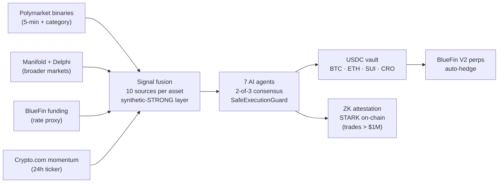

<div align="center">

# ZkVanguard

**The AI-managed crypto vault that lets anyone ride Polymarket alpha.**

Deposit USDC · 7 AI agents allocate using prediction-market signals · Auto-hedged on BlueFin perps · ZK-attested on-chain · Live on Sui mainnet.

[](https://suiscan.xyz/mainnet/object/0x107292a69eea2f6eaf4a4e4727ee25d747b04c1985441b138933f0ef33f7b726)
[](#status)
[](https://www.zkvanguard.xyz)
[](https://www.zkvanguard.xyz/api/health/production)
[](LICENSE)

[Website](https://www.zkvanguard.xyz) · [Live signals](https://www.zkvanguard.xyz/api/predictions/per-asset) · [System health](https://www.zkvanguard.xyz/api/health/production) · [Suiscan](https://suiscan.xyz/mainnet/object/0x107292a69eea2f6eaf4a4e4727ee25d747b04c1985441b138933f0ef33f7b726) · [Docs](./CLAUDE.md)

</div>

---

## Status

Live on Sui mainnet (v0.2.0, deployed 2026-06-12). **Pre-external-audit**, with TVL **deliberately capped at $10K by contract** (strict NAV-oracle mode `ON` in `community_pool_usdc.move`). Cap lifts after the external audit closes. The constraint is intentional — operational proof, not a TVL claim.

15 internal audit phases completed before mainnet. Engine has been running unattended since June 2026 with continuous on-chain NAV snapshots, every active position currently signal-aligned, and zero unhandled production incidents.

## Why ZkVanguard

Polymarket prints **$20B+ per month** in alpha-bearing signal. Riding it consistently requires bots, capital, and 24/7 attention — table stakes for hedge funds, impossible for retail. ZkVanguard collapses that workflow into a one-click USDC vault: seven AI agents fuse prediction-market data with funding rates and price momentum, allocate across BTC / ETH / SUI / CRO, auto-hedge on BlueFin perpetuals, and ZK-attest every meaningful decision on-chain.

## Products

The Vault is the lead product. The same ZK + agent rails power three additional primitives that share the codebase.

| Product | Description | Status |
|---|---|---|
| **The Vault** | USDC vault, AI-allocated across BTC / ETH / SUI / CRO from fused prediction-market signals, auto-hedged on BlueFin perps. | Live on Sui mainnet |
| **Private Hedges** | Confidential perp positions for funds and whales — stealth addresses + commitment hashes; asset, side, size, and PnL stay off-chain. | Live primitive |
| **Private Portfolio Creator** | Wizard-style custom portfolios via [`zk_proxy_vault`](./contracts/sui/sources/zk_proxy_vault.move) (727 LOC); time-locked withdrawals, ZK ownership proofs. | Live primitive |
| **RWA Manager** | Per-user tokenized-asset portfolios via [`rwa_manager.move`](./contracts/sui/sources/rwa_manager.move) (586 LOC); AI-agent rebalancing, ed25519 prover attestation. | Live primitive |

## How it works



Every trade-impacting execution flows through `SafeExecutionGuard`: position caps, slippage limits, **2-of-3 agent consensus on trades > $100K**, ZK proof attestation on any notional > $1M, drawdown halt at 10% from peak NAV, and a circuit breaker that trips after 3 consecutive failures.

## Live mainnet

| Component | Reference |
|---|---|
| Mainnet package (v0.2.0) | [`0x107292a69eea2f6eaf4a4e4727ee25d747b04c1985441b138933f0ef33f7b726`](https://suiscan.xyz/mainnet/object/0x107292a69eea2f6eaf4a4e4727ee25d747b04c1985441b138933f0ef33f7b726) |
| USDC pool state object | `0xe814e0948e29d9c10b73a0e6fb23c9997ccc373bed223657ab65ff544742fb3a` |
| Deployed | 2026-06-12 ([deploy record](./docs/DEPLOY_2026-06-12_v0.2.0.md)) |
| Perp venue | BlueFin V2 mainnet — BTC-PERP · ETH-PERP · SUI-PERP |
| Live health | [`/api/health/production`](https://www.zkvanguard.xyz/api/health/production) |
| Live signals | [`/api/predictions/per-asset`](https://www.zkvanguard.xyz/api/predictions/per-asset) |

> Prior v0.1.0 package `0x9ccb…cd83e598c88` is dormant; pool state was preserved through the v0.1 → v0.2 upgrade. See the [deploy record](./docs/DEPLOY_2026-06-12_v0.2.0.md).

## Verify in 60 seconds

Every claim above is reproducible.

```bash
# Reproduce live pool PnL — read-only, ~5s, hits Sui mainnet RPC + DB read replica
bun run scripts/analyze-pool-pnl.ts

# Check hedge ↔ prediction-signal alignment for every active position
bun run scripts/check-hedge-signal-alignment.ts

# Sanity-check mainnet config + cron heartbeats
bun run scripts/check-sui-mainnet-readiness.ts
```

Or skip the clone:

```bash
curl -s https://www.zkvanguard.xyz/api/health/production | jq
curl -s https://www.zkvanguard.xyz/api/predictions/per-asset | jq
```

## Quickstart

**Prerequisites:** Node 20+, Bun, Python 3.11+ (ZK prover), PostgreSQL connection string.

```bash
git clone https://github.com/ZkVanguard/ZkVanguard.git
cd ZkVanguard

# Install — --legacy-peer-deps is required (Next.js 14 + react-three peer-dep mismatch)
bun install --legacy-peer-deps

# Terminal 1 — Python ZK-STARK prover (FastAPI on :8000)
python -m pip install -r zkp/requirements.txt
python zkp/api/server.py

# Terminal 2 — Next.js dev server (:3000)
bun run dev

# Pre-commit hygiene
bun run typecheck
bun run lint
```

Required environment keys and conventions (CRLF-trim, sponsored-gas, BlueFin invariants) are documented in [`CLAUDE.md`](./CLAUDE.md) — the authoritative repo guide.

## Architecture

```
app/                      Next.js 14 frontend + API + cron handlers
agents/                   7-agent orchestrator + SafeExecutionGuard + MessageBus
contracts/sui/sources/    10 Move contracts (deployed to Sui mainnet)
contracts/core/           Solidity stack (EVM deployment-ready, 6 chains configured)
lib/services/sui/         Sui pool, BlueFin aggregator, hedge reconciler
lib/services/market-data/ Prediction-market signal pipeline + unified price provider
lib/ai/llm-provider.ts    Unified LLM router with provider failover
lib/db/                   PostgreSQL helpers (Aiven)
lib/security/             Production guards, rate limits, price circuit breakers
zk/                       TypeScript ZK-proof client
zkp/                      Python FastAPI ZK-STARK prover (NIST P-521, no trusted setup)
scripts/                  Operations + diagnostic scripts (analyze, reconcile, deploy)
messages/                 12-locale next-intl translations
```

### Agents

| Agent | Role |
|---|---|
| `LeadAgent` | Parses intent, delegates, drives consensus, enforces `SafeExecutionGuard` |
| `RiskAgent` | Multi-timeframe streak, correlation, cascade analysis |
| `HedgingAgent` | BlueFin perp hedging (BTC / ETH / SUI), SL/TP enforcement |
| `SettlementAgent` | Gasless settlement, batch processing |
| `ReportingAgent` | Audit, compliance, ZK proof references |
| `PriceMonitorAgent` | Threshold price watcher, 5-min ticker subscription |
| `SuiPoolAgent` | 4-asset vault allocation, drives BlueFin Aggregator swaps |

## Production infrastructure

All crons run on Upstash QStash, hit `app/api/cron/*` routes, verify the QStash signature (or `CRON_SECRET` fallback), and idempotency-claim a slot in `cron_state` before acting.

### Trading and execution

| Route | Cadence | Purpose |
|---|---|---|
| `polymarket-edge-trader` | 5 min | Autonomous BlueFin perp trader (Kelly-fractional sizing, 24h kill switch) |
| `bluefin-health` | 5 min | 3-strike venue de-risk → close-all on degradation |
| `liquidation-guard` | 10 min | Liquidation-distance alerts and emergency close |

### Monitoring

| Route | Cadence | Purpose |
|---|---|---|
| `health-monitor` | 10 min | Hits `/api/health/production`, Discord alert on degradation |
| `pool-nav-monitor` | 15 min | NAV snapshot independent of allocation logic |
| `hedge-monitor` | 15 min | Hedge-state monitoring |

### Reconciliation

| Route | Cadence | Purpose |
|---|---|---|
| `bluefin-db-reconcile` | 15 min | DB ↔ BlueFin drift repair, orphan re-adoption |
| `sui-hedge-reconcile` | hourly | On-chain Move ↔ BlueFin reconcile |

### Vault operations

| Route | Cadence | Purpose |
|---|---|---|
| `sui-community-pool` | 30 min | NAV, AI allocation, rebalance swaps, auto-hedge trigger |
| `sui-collect-fees` | daily | Management + performance fee sweep to treasury |

## Tech stack

- **Frontend & API** — Next.js 14 (App Router), TypeScript, TailwindCSS, next-intl (12 locales)
- **Blockchain** — Sui (Move) on mainnet; Solidity for Cronos, Oasis, Hedera, Sepolia, Ethereum (configured; EVM expansion is a deployment step)
- **Zero-knowledge** — Python FastAPI server running a STARK system over NIST P-521 (no trusted setup, CUDA-accelerated when available)
- **Database** — PostgreSQL on Aiven (migrated from Neon, May 2026)
- **Cron, cache, locks** — Upstash QStash + Redis
- **Trading venues** — BlueFin V2 mainnet perps + BlueFin Aggregator (7 DEXes on Sui: Cetus, DeepBook, Turbos, FlowX, Aftermath, BlueFin, NAVI)
- **AI providers** — Unified router with failover: Crypto.com AI Agent SDK → ASI → OpenAI → Anthropic → Ollama
- **Hosting** — Vercel (region `sin1`)

## Revenue and token model

### Live revenue (today)

- **50 bps annual management fee + 10% performance fee** on every USDC vault deposit
- Fees route to `FeeManagerCap` on an MSafe multisig — on-chain, public, auditable

### Planned (post-audit)

- **Tiered subscriptions** bundling premium feature access: Free trial · Retail ($99/mo) · Pro ($499/mo) · Institutional ($2,499/mo) · Enterprise (custom). Targets private-hedge access, RWA-portfolio creation, dedicated SLAs, white-label deployment.
- **Per-trade fees** on the autonomous perp trader

### Token mechanic (designed, not launched)

- **Utility-first:** governance over fee parameters and protocol upgrades; staking gates discounted vault fees and early access to new signal universes
- **Points → token bridge** for the Founding-100 retail cohort (3× multiplier from day one)
- **Value capture:** percentage of on-chain fees routes to staking rewards / buyback-burn (Pendle / GMX precedent)
- **Launch posture:** no public sale; utility-token classification target; **TGE targeted Month 9–12** post-audit close

## Tests

```bash
bun run test                              # Full Jest suite
bun run test:agents                       # Agent system
bun run test:integration                  # ZK STARK + signal pipeline (start Python server first)
bun run test:contracts                    # Hardhat / Solidity
bun run scripts/test-sui-services-e2e.ts  # 9 Sui service suites
bun run test-bulletproof-e2e.ts           # 13 sections / 28 production-readiness checks
```

## Security

ZkVanguard is **pre-external-audit**. Mainnet TVL is capped at $10K by contract to bound blast radius until the audit closes. Mitigations in place today:

- 15 internal audit phases completed before mainnet deploy
- Strict NAV-oracle mode `ON` (deposits/withdrawals revert when cron oracle attestation is > 2h stale)
- 2-of-3 agent consensus for trades > $100K
- ZK proof attestation infrastructure for any notional > $1M (triggers at scale)
- 10% drawdown halt from peak NAV (auto-pauses the vault)
- 3-way reconciliation topology (on-chain Move ↔ BlueFin ↔ Postgres)
- OFAC geo-block middleware (KP, IR, SY, CU, RU, BY)
- 10 production crons with idempotency-claim locks in `cron_state`

**Responsible disclosure.** Please report security issues privately to `ashishregmi2017@gmail.com`. Do not file public issues for active vulnerabilities.

## Documentation

- [`CLAUDE.md`](./CLAUDE.md) — authoritative repo guide (architecture, env, gotchas, BlueFin invariants, reconciliation topology)
- [`docs/ARCHITECTURE.md`](./docs/ARCHITECTURE.md) · [`docs/SUI_DEPLOYMENT.md`](./docs/SUI_DEPLOYMENT.md) · [`docs/MAINNET_READINESS.md`](./docs/MAINNET_READINESS.md)
- [`docs/DEPLOY_RUNBOOK.md`](./docs/DEPLOY_RUNBOOK.md) — incident response, env presets, BlueFin invariants, admin endpoints
- [`docs/DEPLOY_2026-06-12_v0.2.0.md`](./docs/DEPLOY_2026-06-12_v0.2.0.md) — v0.2.0 mainnet deploy record

## Acknowledgments

Built on the shoulders of [Sui](https://sui.io), [BlueFin V2](https://bluefin.io), [Polymarket](https://polymarket.com), [Manifold](https://manifold.markets), [Crypto.com](https://crypto.com), [Aiven](https://aiven.io), [Upstash](https://upstash.com), [Vercel](https://vercel.com), and the [Tether WDK](https://github.com/tetherto/wdk) ecosystem.

## License

[Apache 2.0](./LICENSE)
