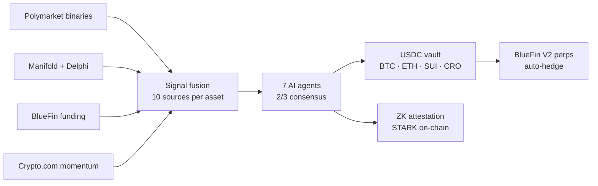

<div align="center">

# ZkVanguard

**The AI-managed crypto vault that lets anyone ride Polymarket alpha.**

Deposit USDC · 7 AI agents allocate using prediction-market signals · Auto-hedged on BlueFin perps · ZK-attested on-chain · Live on Sui mainnet.

[](https://suiscan.xyz/mainnet/object/0x107292a69eea2f6eaf4a4e4727ee25d747b04c1985441b138933f0ef33f7b726)
[](https://www.zkvanguard.xyz)
[](https://www.zkvanguard.xyz/api/health/production)
[](LICENSE)

[Website](https://www.zkvanguard.xyz) · [Live signals](https://www.zkvanguard.xyz/api/predictions/per-asset) · [System health](https://www.zkvanguard.xyz/api/health/production) · [Suiscan](https://suiscan.xyz/mainnet/object/0x107292a69eea2f6eaf4a4e4727ee25d747b04c1985441b138933f0ef33f7b726) · [Docs](./CLAUDE.md)

</div>

---

## What it is

Polymarket prints **\$20B+ a month** in alpha-bearing signal. Riding it consistently requires bots, capital, and 24/7 attention — retail can't touch it. ZkVanguard turns Polymarket alpha into a one-click USDC vault: seven AI agents fuse prediction-market data with funding rates and price momentum, allocate across BTC / ETH / SUI / CRO, auto-hedge on BlueFin perps, and ZK-attest every meaningful decision on-chain.

The vault has been running unattended on Sui mainnet since June 2026, with TVL deliberately capped at \$10K by contract (strict NAV-oracle mode `ON`) until external audit completes.

## Products

The Vault is the lead product. The same ZK + agent rails power three additional products that share the codebase:

| Product | What it does | Status |
|---|---|---|
| 🔓 **The Vault** | USDC vault, AI-allocates BTC / ETH / SUI / CRO from prediction-market signals, auto-hedged on BlueFin perps | Live on Sui mainnet |
| 🔒 **Private Hedges** | Confidential perp positions for funds and whales — stealth addresses + commitment hashes; asset, side, size, and PnL stay off-chain | Live primitive |
| 🔒 **Private Portfolio Creator** | Wizard-style custom portfolios via [`zk_proxy_vault`](./contracts/sui/sources/zk_proxy_vault.move) (727 LOC); time-locked withdrawals, ZK ownership proofs | Live primitive |
| 🏢 **RWA Manager** | Per-user tokenized-asset portfolios via [`rwa_manager.move`](./contracts/sui/sources/rwa_manager.move) (586 LOC); AI-agent rebalancing, ed25519 prover attestation, 50 bps protocol fee | Live primitive |

## Revenue model

| Layer | Detail |
|---|---|
| **Protocol fees** (live today) | 50 bps annual management + 10% performance on every USDC vault deposit. Per-trade fees on the autonomous BlueFin perp trader unlock post-audit. All fees route to `FeeManagerCap` on a MSafe multisig — on-chain, public, auditable. |
| **Tiered subscriptions** (premium feature access) | Free trial · Retail (\$99/mo) · Pro (\$499/mo) · Institutional (\$2,499/mo) · Enterprise (custom) — bundle private-hedge access, RWA-portfolio creation, dedicated SLAs, and white-label deployment |
| **Token-integrated value capture** | Designed for Month 9-12 TGE post-audit: percentage of on-chain fees route to staking rewards / buyback-burn (Pendle / GMX precedent). No public sale planned. |

## How it works



## Live mainnet

| | |
|---|---|
| **Package (v0.2.0)** | [`0x107292a69eea2f6eaf4a4e4727ee25d747b04c1985441b138933f0ef33f7b726`](https://suiscan.xyz/mainnet/object/0x107292a69eea2f6eaf4a4e4727ee25d747b04c1985441b138933f0ef33f7b726) |
| **USDC Pool state** | `0xe814e0948e29d9c10b73a0e6fb23c9997ccc373bed223657ab65ff544742fb3a` |
| **Deployed** | 2026-06-12 ([deploy record](./docs/DEPLOY_2026-06-12_v0.2.0.md)) |
| **Perp venue** | BlueFin V2 mainnet (BTC-PERP · ETH-PERP · SUI-PERP) |
| **Status** | [Live health endpoint](https://www.zkvanguard.xyz/api/health/production) |

The prior v0.1.0 package (`0x9ccb…cd83e598c88`) is dormant — pool state was preserved through the v0.1 → v0.2 upgrade.

## Verify in 60 seconds

```bash
# Reproduce live pool PnL — hits Sui mainnet RPC + DB read replica
bun run scripts/analyze-pool-pnl.ts

# Check hedge ↔ prediction-signal alignment for every active position
bun run scripts/check-hedge-signal-alignment.ts

# Sanity-check mainnet config + cron heartbeats
bun run scripts/check-sui-mainnet-readiness.ts
```

Or skip the clone:

- **[`/api/predictions/per-asset`](https://www.zkvanguard.xyz/api/predictions/per-asset)** — current fused signals per asset
- **[`/api/health/production`](https://www.zkvanguard.xyz/api/health/production)** — cron heartbeats, BlueFin balance, NAV freshness

## Quickstart

Prereqs: **Node 20+**, **Bun**, **Python 3.11+** (ZK prover), PostgreSQL.

```bash
git clone https://github.com/ZkVanguard/ZkVanguard.git
cd ZkVanguard
bun install --legacy-peer-deps

# Terminal 1 — Python ZK-STARK prover (FastAPI :8000)
python -m pip install -r zkp/requirements.txt
python zkp/api/server.py

# Terminal 2 — Next.js dev (:3000)
bun run dev

# Pre-commit checks
bun run typecheck
bun run lint
```

Required env keys are documented in [`CLAUDE.md`](./CLAUDE.md) (CRLF-trim conventions, sponsored-gas patterns, BlueFin invariants).

## Architecture

```
app/                          Next.js 14 frontend + API + cron handlers
agents/                       7-agent orchestrator + SafeExecutionGuard + MessageBus
contracts/sui/sources/        10 Move contracts (deployed to Sui mainnet)
contracts/core/               Solidity stack (EVM deployment-ready, 6 chains configured)
lib/services/sui/             Sui pool, BlueFin aggregator, hedge reconciler
lib/services/market-data/     Prediction-market signal stack + unified price provider
lib/ai/llm-provider.ts        Unified LLM router (Crypto.com → ASI → OpenAI → Claude → Ollama)
lib/db/                       PostgreSQL helpers (Aiven)
lib/security/                 Production guards, rate limits, price circuit breakers
zk/                           TypeScript ZK-proof client
zkp/                          Python FastAPI ZK-STARK prover (NIST P-521, no trusted setup)
scripts/                      ~150 ops + diagnostic scripts
i18n/, messages/              12-locale next-intl translations
```

**Seven agents** (see [`agents/`](./agents/)):

| Agent | Role |
|---|---|
| `LeadAgent` | Parses intent, delegates, drives consensus, enforces `SafeExecutionGuard` |
| `RiskAgent` | Multi-timeframe streak, correlation, cascade analysis |
| `HedgingAgent` | BlueFin perp hedging (BTC / ETH / SUI), SL/TP |
| `SettlementAgent` | Gasless settlement, batch processing |
| `ReportingAgent` | Audit + compliance, ZK proof references |
| `PriceMonitorAgent` | Threshold price watcher with 5-min ticker subscription |
| `SuiPoolAgent` | 4-asset allocation, drives BlueFin Aggregator swaps |

Every trade-impacting execution flows through `SafeExecutionGuard`: position caps, slippage limits, 2/3 agent consensus on trades > \$100K, ZK proof attestation for any notional > \$1M, drawdown halt at 10% from peak NAV, circuit breaker tripping after 3 consecutive failures.

## Production crons

All crons run on Upstash QStash and hit `app/api/cron/*` routes. Each route verifies the QStash signature (or `CRON_SECRET` fallback) and idempotency-claims a slot in `cron_state` before acting.

| Route | Cadence | Purpose |
|---|---|---|
| `polymarket-edge-trader` | 5 min | Autonomous BlueFin perp trader (Kelly-fractional sizing, 24h kill switch) |
| `bluefin-health` | 5 min | 3-strike venue de-risk → close-all on degradation |
| `liquidation-guard` | 10 min | Liquidation-distance alerts + emergency close |
| `health-monitor` | 10 min | Hits `/api/health/production`, Discord on degradation |
| `pool-nav-monitor` | 15 min | NAV snapshot independent of allocation logic |
| `hedge-monitor` | 15 min | Hedge state monitoring |
| `bluefin-db-reconcile` | 15 min | DB ↔ BlueFin drift repair |
| `sui-community-pool` | 30 min | NAV, AI allocation, rebalance swaps, auto-hedge trigger |
| `sui-hedge-reconcile` | hourly | On-chain Move ↔ BlueFin reconcile |
| `sui-collect-fees` | daily | Management + performance fee sweep to treasury |

## Tech stack

- **Frontend / API** — Next.js 14 (App Router), TypeScript, TailwindCSS, next-intl
- **Blockchain** — Sui (Move) on mainnet; Solidity for Cronos · Oasis · Hedera · Sepolia · Ethereum (configured, EVM expansion is a deployment step)
- **Zero-knowledge** — Python FastAPI server running a STARK system over NIST P-521 (no trusted setup, CUDA-accelerated when available)
- **Database** — PostgreSQL on Aiven (migrated from Neon, May 2026)
- **Cron / cache / locks** — Upstash QStash + Redis
- **Trading venue** — BlueFin V2 mainnet perps + BlueFin Aggregator (7 DEXes on Sui)
- **AI providers** — Unified router (Crypto.com Intelligent SDK → ASI → OpenAI → Anthropic → Ollama)
- **Deploy** — Vercel (region `sin1`)

## Documentation

- [`CLAUDE.md`](./CLAUDE.md) — the authoritative repo guide (architecture, env, all gotchas, BlueFin invariants, reconciliation topology)
- [`docs/ARCHITECTURE.md`](./docs/ARCHITECTURE.md), [`docs/SUI_DEPLOYMENT.md`](./docs/SUI_DEPLOYMENT.md), [`docs/MAINNET_READINESS.md`](./docs/MAINNET_READINESS.md)
- [`docs/DEPLOY_RUNBOOK.md`](./docs/DEPLOY_RUNBOOK.md) — incident response, env presets, BlueFin invariants, admin endpoints
- [`docs/DEPLOY_2026-06-12_v0.2.0.md`](./docs/DEPLOY_2026-06-12_v0.2.0.md) — v0.2.0 deploy record

## Tests

```bash
bun run test                              # Full Jest suite
bun run test:agents                       # Agent system
bun run test:integration                  # ZK STARK + signal pipeline (start Python first)
bun run test:contracts                    # Hardhat / Solidity
bun run scripts/test-sui-services-e2e.ts  # 9 Sui service suites
bun run test-bulletproof-e2e.ts           # 13 sections / 28 checks
```

## License

[Apache 2.0](./LICENSE)
